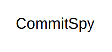

# CommitSpy V2
## Laziness for the good of humanity.


### [Version 1 found here](https://commitspy.netlify.app/)

>**CommitSpy** allows you to do the following

- [x] Sign up as a User.
- [x] Deposit cash in exchange for coins.
- [x] Monitor and set commit goals for a git repository.
- [x] Donate your cash to a charity when you fail to meet up.


## Built With

- [Golang](https://go.dev/)
- [Gin](https://github.com/gin-gonic/gin)
- [Gorm](https://gorm.io/)
- [PostgreSQL](https://www.postgresql.org/)

## Getting Started
This application can be deployed locally by the following ways.
- Using the local environment.

### Prerequisites
If you are considering the first two options of deployment, you would need to have a local installation of MySQL.

### Local Environment

Foremost, you have to clone this repository and install all the dependencies with the following commands.
```bash
git clone https://github.com/teezzan/commitspy-v2-v2.git
cd commitspy-v2
go get

```
Rename the `.env.example` to `.env` and customize it to your local machines specifications.

**Note**: `DB_NAME` will not be created automatically and would need to be manually created.

Run `make run` to start the local server.


## Authors

**[Taiwo Yusuf](https://github.com/teezzan/)**